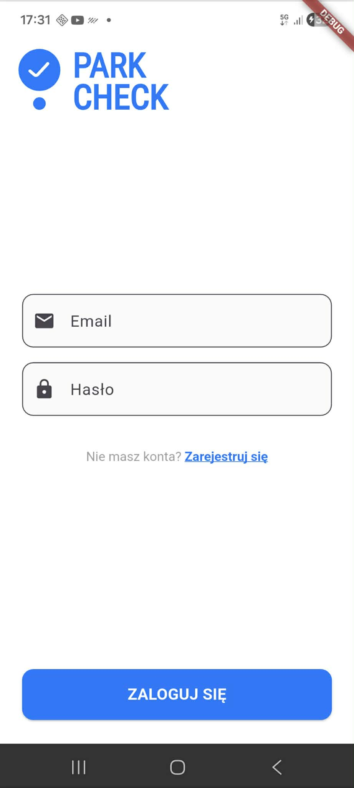
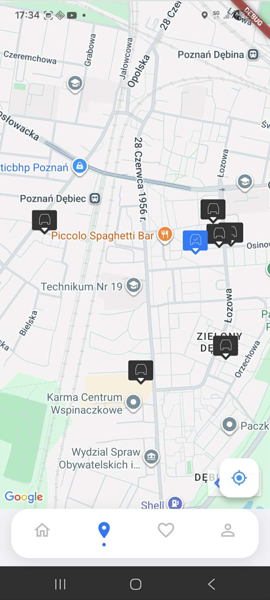
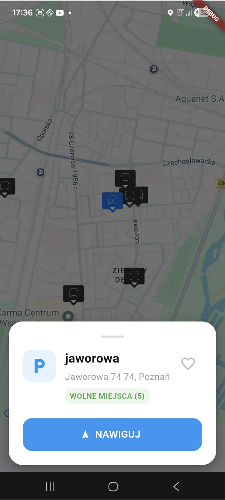

 # 🚗 Parkcheck - Mobile Application

Modern multiplatform mobile application built with **Flutter** and **Firebase**, designed for finding and managing parking areas.

## 🚀 Live Web Preview
You can test the mobile interface directly in your browser here:  
👉 **[CLICK HERE TO OPEN LIVE PREVIEW](https://remlithe.github.io/Parkcheck/)**

---

## 📱 Interface & Screenshots

| Login Screen | Interactive Map | Parking Details |
| :---: | :---: | :---: |
|  |  |  |

### Key Features:
* **Interactive Map View:** Browse available parking spaces in real-time (`map_screen.dart`).
* **Firebase Authentication:** Secure user registration and login (`auth_service.dart`).
* **Favorites System:** Save your preferred parking spots for quick access (`favorites_screen.dart`).
* **Profile & Payments:** Manage user profiles and mock payment configurations (`payment_setup_screen.dart`).

---

## 🛠️ Technology Stack & Architecture

* **Frontend:** Flutter & Dart (Web build deployed on GitHub Pages)
* **Backend:** Firebase (Authentication & cloud configurations)
* **Data Layer:** Clean models implemented for structural handling (`parking_area_model.dart`, `user_model.dart`).
